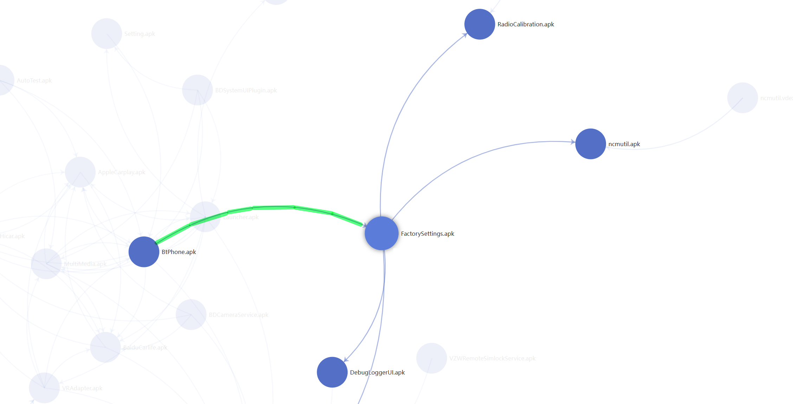

## Entity-Relation Diagram Assisted Hacking Tool
Smart connected vehicles and smartphones contain a large number of APK files, which have intricate call relationships between them. An innovative approach has been proposed to create a visual and interactive call relationship analysis tool. By analyzing the call relationships between APK packages, an entity-relationship diagram is generated. By observing the direction of the arrows, one can intuitively see the call relationships. This tool has been used to identify dozens of engineering mode call chains in vehicle, and by reversing the caller, the engineering mode has been successfully activated, providing an analysis entry for vehicle penetration.

### Start web server

```sh
cd server && python app.py
```

Demo: [ERH-APK](https://delikely.github.io/ERH/)

### Generate Apk relation diagram

```sh
$ python apk_relation_finder.py -p "car" -d "/opt/car/filesystem/"

 \          =o)
 (o>         /\
_(()_apk2apk_\_V_
 //           \
               \
    -- Powered by Delikely

|████████████████████████████████████████| 549 /549 [100%] in 3:21.4 (3.42/s)
Relation Diagram url: http://127.0.0.1:13337/apk-relation?date=1720891507&project=car
```

Use browser to open diagram page, http://127.0.0.1:13337/apk-relation?date=1720891507&project=car

### Diagram Usage

#### Find factory/engineer entries

Use the diagram to locate the entry for the factory or engineer.

As shown below, The entry can be found from `BtPhone.apk` to `FactorySettings.apk`.

.

After decompiling `BtPhone.apk`, find that `FactorySettings.apk` can be opened by using [**android_secret_code**](https://developer.android.com/reference/android/telephony/TelephonyManager#ACTION_SECRET_CODE) through the **Dial Board**.

```java
// com.***.btactivity.k218.fragment.BtPhoneFragment
if (this.mEditText.getText().toString().equals("*#1337#*")) {
    try {
        Log.d(TAG, "onClick getLaunchIntentForPackage");
        startActivity(BtApplication.getContext().getPackageManager().getLaunchIntentForPackage("com.debugtools"));
        return;
    } catch (Exception e) {
        Log.d(TAG, "onClick The_app_was_not_found");
        ToastUtils.show(getString(R.string.The_app_was_not_found));
        e.printStackTrace();
        Log.d(TAG, "onClick Exception = " + e);
        return;
    }
}
```

### Timeline

- 2024/06/26 First public on [Off-by-One Conference 2024](https://offbyone.sg)
